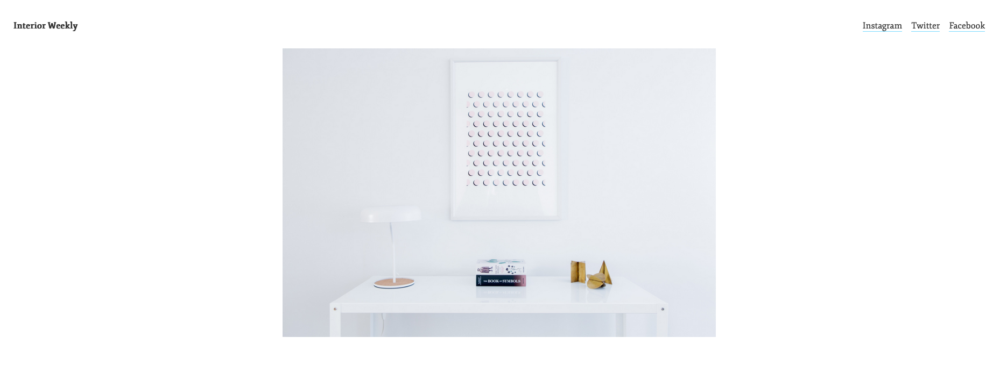
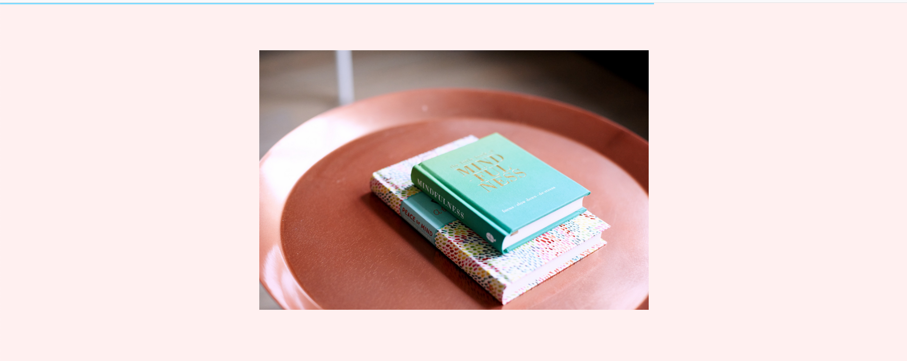
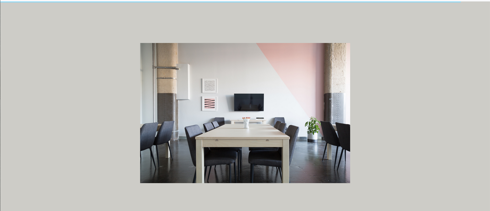

# Interior-Weekly
### Javascript (scroll event)

I have built this responsive site from scratch to explore and learn a little bit more Jquery.
When we scroll and get to more than 50px the header hides and when we go back up again it shows itself. When we get to certain sections, the background color will change. And a long the top bar we have a progress light blue line that runs with us. When we get to the bottom of the page it reaches full and when we are at the top its at zero.

Check this website [here](https://interior-weekly-601-draft.superhi.com)
 
 
 
 

